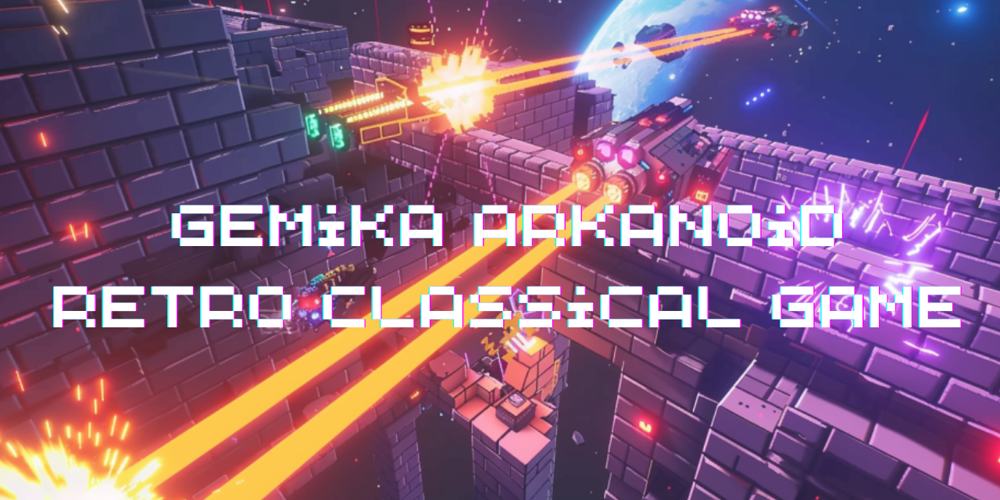

# 🕹️ Gemika Arkanoid Retro Classical Game 🎮



Welcome to the ultimate retro-style Arkanoid game! Relive the 80s arcade glory and break all the bricks to climb to the top of the leaderboard! 🚀

## Table of Contents 📚

1. [Introduction](#introduction-)
2. [Features](#features-)
3. [Getting Started](#getting-started-)
   - [Prerequisites](#prerequisites-)
   - [Installing Python](#installing-python-)
   - [Installing Pygame](#installing-pygame-)
   - [Installation](#installation-)
4. [How to Play](#how-to-play-)
5. [File Structure](#file-structure-)
6. [Configuration](#configuration-)
7. [Troubleshooting](#troubleshooting-)
   - [ModuleNotFoundError: No module named 'pygame'](#modulenotfounderror-no-module-named-pygame)
   - [Step-by-Step Solution](#step-by-step-solution)
   - [Additional Tips](#additional-tips)
8. [Credits](#credits-)
9. [License](#license-)

## Introduction 🕹️

Welcome to our modern take on the classic 80s arcade game, Arkanoid! This game is designed to capture the nostalgic essence of old-school gaming while incorporating modern features and improvements. Perfect for both retro gamers and newcomers, Gemika Arkanoid Retro Game offers hours of fun and excitement. Experience the thrill of breaking bricks, bouncing balls, and climbing the leaderboard in a game that will transport you back to the golden age of arcades. 🎉

## Features ✨

- **🟦 Configurable Levels**: Customize your levels for endless fun.
- **💾 Leaderboard**: Compete with friends and players worldwide. Record your high scores and aim for the top.
- **🔊 Sound Effects**: Enjoy immersive and retro sound effects that enhance your gaming experience (Note: Sound effects are not included; users need to add them to the appropriate directory).
- **🔄 Difficulty Levels**: Choose from different difficulty settings to match your skill level.
- **🕹️ Retro Graphics**: Relive the 80s with retro-style graphics and gameplay mechanics.
- **🎮 Intuitive Controls**: Simple and intuitive controls that anyone can pick up and play.

## Getting Started 🚀

Before you begin, make sure you have Python installed (preferably version 3.6 or higher). You will also need to install the Pygame library, which is used to create games in Python.

### Prerequisites 🛠️

Ensure you have Python installed on your machine.

### Installing Python 🐍

#### Windows

1. **Download Python**: Go to the [Python Downloads page](https://www.python.org/downloads/windows/) and download the latest installer.
2. **Run the Installer**: Open the installer and follow the prompts. Make sure to check the box that says "Add Python to PATH".
3. **Verify Installation**: Open Command Prompt and type:
   ```bash
   python --version
   ```

#### macOS

1. **Download Python**: Visit the [Python Downloads page](https://www.python.org/downloads/macos/) and download the latest installer.
2. **Run the Installer**: Open the installer and follow the instructions.
3. **Verify Installation**: Open Terminal and type:
   ```bash
   python3 --version
   ```

#### Linux

1. **Use Package Manager**: Open your terminal and run:
   ```bash
   sudo apt-get update
   sudo apt-get install python3 python3-pip
   ```
2. **Verify Installation**: Type:
   ```bash
   python3 --version
   ```

### Installing Pygame 🕹️

Install Pygame with the following command:

```bash
pip install pygame
```

or

```bash
pip3 install pygame
```

### Installation 📥

1. **Clone the Repository**:

   ```bash
   git clone https://github.com/leonism/Gemika-Arkanoid-Retro-Classical-Game.git
   cd Gemika-Arkanoid-Retro-Classical-Game/
   ```

2. **Ensure Directory Structure**:
   Make sure your directory structure looks like this:

   ```
   Gemika-Arkanoid-Retro-Classical-Game/
   │
   ├── assets/
   │   ├── sounds/
   │   │   ├── hit.wav           # Sound files are not included, so you may customize
   │   │   ├── lose_life.wav     # Images files are not included, so you may customize
   │   │   └── game_over.wav
   │   ├── images/
   │   │   ├── brick.png
   │   │   ├── paddle.png
   │   │   └── ball.png
   │   └── leaderboard.txt (created automatically)
   │
   ├── arkanoid/                 # Game source code
   │   ├── __init__.py           # Init file to mark the package
   │   ├── config.py             # Configuration file
   │   ├── game.py               # Main game logic
   │   ├── sprites.py            # Sprite classes
   │   ├── utils.py              # Utility functions
   │
   └── run_game.py               # Entry point to run the game
   ```

3. **Run the Game**:
   Navigate to the directory containing `run_game.py` and execute the following command to start the game:
   ```bash
   python run_game.py
   ```

## How to Play 🎮

- **Move the Paddle**: Use the left and right arrow keys to move the paddle.
- **Bounce the Ball**: Prevent the ball from falling off the screen by bouncing it with the paddle.
- **Break All Bricks**: Your goal is to break all the bricks to advance to the next level.
- **Score Points**: Each brick you break scores points. Try to achieve the highest score!
- **Monitor Lives**: You start with 3 lives. Losing the ball costs a life. Lose all lives, and the game is over.

## File Structure 🗂️

```
Gemika-Arkanoid-Retro-Classical-Game/
│
├── assets/                   # Assets folder containing sounds and images
│   ├── sounds/               # Sound files are not included
│   │   ├── hit.wav
│   │   ├── lose_life.wav
│   │   └── game_over.wav
│   ├── images/               # Image files are not included
│   │   ├── brick.png
│   │   ├── paddle.png
│   │   └── ball.png
│   └── leaderboard.txt       # Leaderboard file (created automatically)
│
├── arkanoid/                 # Game source code
│   ├── __init__.py           # Init file to mark the package
│   ├── config.py             # Configuration file
│   ├── game.py               # Main game logic
│   ├── sprites.py            # Sprite classes
│   ├── utils.py              # Utility functions
│
└── run_game.py               # Entry point to run the game
```

## Configuration ⚙️

You can customize the game settings by modifying the `config.py` file. Here are some key configurations you can adjust:

- **Screen Dimensions**: Set the width and height of the game window.
- **FPS**: Adjust the frames per second for smooth gameplay.
- **Colors**: Customize the color scheme of your game elements.
- **Asset Paths**: Change the paths for your sound and image files if needed.

## Troubleshooting 🛠️

### ModuleNotFoundError: No module named 'pygame'

This indicates that Pygame is not installed. Install it using:

```bash
pip install pygame
```

Or else if you encountered the following error :

```bash
`/usr/local/bin/pip: bad interpreter: /usr/bin/python: no such file or directory`
```

This suggests that the `pip` command is pointing to a Python interpreter that does not exist on your system.

### Step-by-Step Solution

1. **Verify Python Installation**:

   ```bash
   python3 --version
   ```

2. **Install Pygame using Python3**:

   ```bash
   python3 -m ensurepip --upgrade
   python3 -m pip install pygame
   ```

3. **Running the Game**:
   ```bash
   python3 run_game.py
   ```

### Additional Tips

1. **If `pip` is not working**:

   ```bash
   python3 -m ensurepip --upgrade
   ```

2. **Check your PATH**:

   ```bash
   echo $PATH
   ```

   Ensure the correct Python binaries are in your PATH. If necessary, add Python to your PATH by modifying your `.zshrc` or `.bashrc` file:

   ```bash
   export PATH="/usr/local/bin:/usr/bin:/bin:/usr/sbin:/sbin:/Library/Frameworks/Python.framework/Versions/3.8/bin:$PATH"
   ```

3. **Use a Virtual Environment**:
   ```bash
   python3 -m venv venv
   source venv/bin/activate
   pip install pygame
   python run_game.py
   ```

By following these steps, you should be able to resolve the issues and get your Arkanoid game running smoothly. If you

encounter any further issues, please provide the specific error messages so we can assist you further.

## Credits 🎤

- **Sound Effects**: Thanks to [FreeSound](https://freesound.org/), [Zapsplat](https://www.zapsplat.com/), and [SoundBible](http://soundbible.com/) for providing the sound assets.
- **Images**: Special thanks to [OpenGameArt](https://opengameart.org/), [Kenney.nl](https://kenney.nl/assets), and [GameArt2D](https://www.gameart2d.com)

## License 📄

This project is licensed under the MIT License. See the [LICENSE](LICENSE) file for details.
